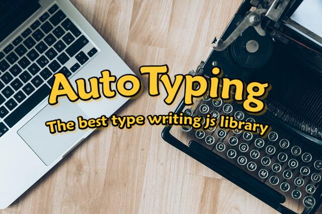

# AutoTyping.js

#### `New release, new features:`
22 February 2021
- new option - **textDeleteOptions**
- new method - **stop()**

This is a JavaScript library that allows you to easily and quickly implement a type writer effect on your website or application.

There are many options available for you that you may or may not include, the JavaScript AutoTyping library will definitely work for you.

Lightweight. Only 4.06kb - minified version.

[AutoTyping DEMO](https://autotyping.smarty.rs)

----

### Installation

Just clone or download the zip of [this](https://github.com/igor-stojcic/AutoTyping.js) GitHub repository

or via [npm](https://www.npmjs.com/package/autotyping):

~~~bash
npm install --save autotyping
~~~

### Setup

~~~html
<!-- just AutoTyping.js or .min.js -->

~~~

and in your custom.js or direct between

`` tag in HTML add:

~~~javascript
const myText = new AutoTyping({
  id: 'example',                   //Your HTML element id (string) - REQUIRED
  typeText: ['words','sentences'] //Your text (array with strings)
}).init();
~~~

### `Options`

- **id:** Your HTML element id (string) - `REQUIRED`
- **typeText:** Your text (array with strings)
- **textColor:** Color of Your text (string) *default('#000')
- **typeSpeed:** Interval between each character (nummber) *default(100ms)
- **typeRandom:** Random interval between each character (boolean) *default(false)
- **typeDelay:** Delay interval between typing two texts (number) *default(100ms)
- **cursor:** Character for cursor (string) *default('|')
- **cursorColor:** Color of the cursor (string) *default('#000')
- **cursorSpeed:** Interval of the cursor blinks (number) *default(300ms)
- **deleteSpeed:** Interval of deleting text (number) *default(50ms)
- **deleteDelay:** Delay interval before deleting text (number) *default(2000ms)
- **typeInfinity:** Autotyping infinity or only one cycle (boolean) *default(true)
- **callBack:** Callback function - triggered after every typing cycle (object) *default(null)
  - **_counter:_** _Every typing cycle counter is reduced by 1, after 0 it is reset (number)_
  - **_method: function(counter){...}_** _Your function (function)_
- **textDeleteOptions:** deleting a text to a specific character, and typing a new sequel (object) *default(null)
  - **_(index of strings in "typeText" Array - Example *0 : {...}*):_** _(object)_
    - **_deleteToChar:_** _index of the characters of the selected string, where the writing new part of text beginning (number)_
    - **_continueThis:_** _a new piece of text to be written (string)_

> If you set a value for a color property to an empty string, the element will inherit the style from the parent element.

----

### `Methods`

- **init()** - start AutoTyping
- **stop()** - stop AutoTyping after last triggered cycle

### Example
~~~javascript
const myText = new AutoTyping({
  id: 'example',                   //Your HTML element id (string) - REQUIRED
  typeText: ['words','sentences'], //Your text (array with strings) - REQUIRED
  textColor: '#dc3545',            //Color of Your text (string) *default('#000')
  typeSpeed: 50,                   //Interval between each character (nummber) *default(100ms)
  typeRandom: true,                //Random interval between each character (boolean) *default(false)
  typeDelay: 200,                  //Delay interval between typing two texts (number) *default(100ms)
  cursor: '/',                     //Character for cursor (string) *default('|')
  cursorColor: '#dc3545',          //Color of the cursor (string) *default('#000')
  cursorSpeed: 200,                //Interval of the cursor blinks (number) *default(300ms)
  deleteSpeed: 50,                 //Interval of deleting text (number) *default(50ms)
  deleteDelay: 2000,               //Delay interval before deleting text (number) *default(2000ms)
  typeInfinity: true               //Autotyping infinity or only one cycle (boolean) *default(true)
  callBack: {                      //Callback function - triggered after every typing cycle (object) *default(null)
    counter: 4                     //Every typing cycle counter is reduced by 1, after 0 it is reset (number)
    method: function(counter){...} //Your function (function)
  },
  textDeleteOptions: {             //deleting a text to a specific character, and typing a new sequel (object) *default(null)
    0: {                           //index of strings in "typeText" Array (key-number : value-object)
      deleteToChar: 2,             //index of the characters of the selected string, where the writing new part of text beginning (number)
      continueThis: "rld best"     //a new piece of text to be written (string)
    }
  }
}).init();
~~~
